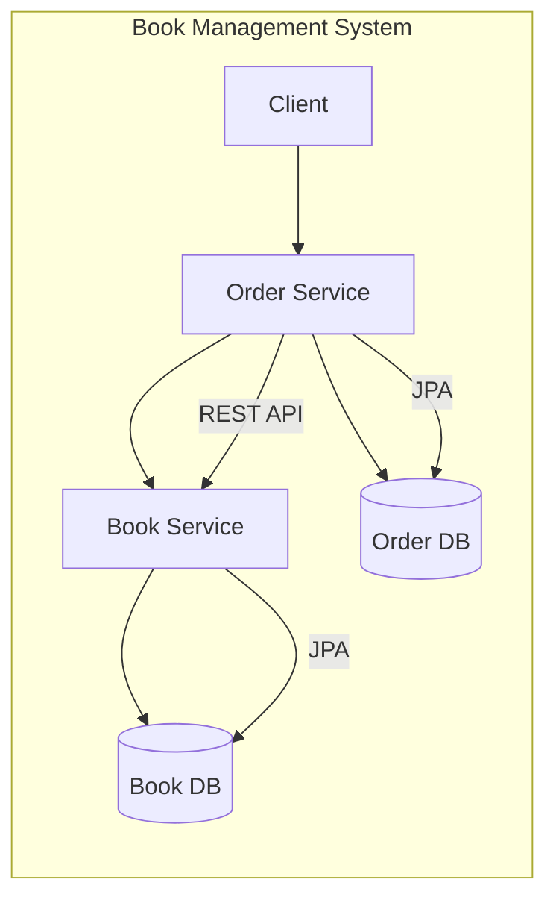
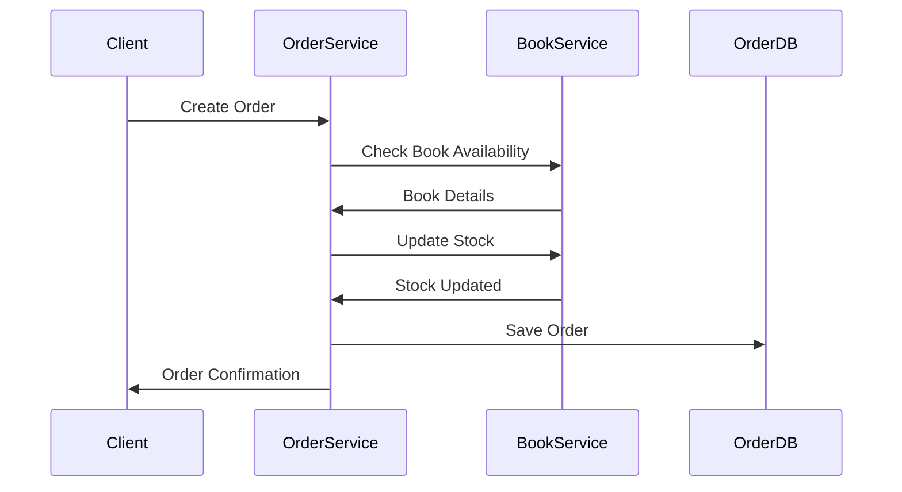

# Book Management Architecture

## Book Service
A RESTful service managing the book inventory with the following endpoints:

### Endpoints
Base URL: /api/books

GET /
- Returns all books
- Response: List of Book objects

GET /{id}
- Returns a specific book by ID
- Response: Book object or 404 if not found

POST /
- Creates a new book
- Request Body: CreateBookRequest (title, author, price, stockQuantity)
- Response: Created Book object

PUT /{id}/stock
- Updates book stock quantity
- Request Param: quantity
- Response: Updated Book object

DELETE /{id}
- Deletes a specific book
- Response: 204 No Content

DELETE /
- Deletes all books
- Response: 204 No Content

## Order Service
A RESTful service managing orders with integration to Book Service using OpenFeign client.
### Endpoints
Base URL: /api/orders

POST /
- Creates a new order
- Request Body: OrderRequest (userId, items[bookId, quantity])
- Validates book availability
- Updates book stock
- Response: Created Order object

GET /user/{userId}
- Returns all orders for a specific user
- Response: List of Order objects

GET /{orderId}
- Returns specific order details
- Response: Order object or 404 if not found

PUT /{orderId}/status
- Updates order status
- Request Param: status
- Response: Updated Order object

DELETE /{orderId}
- Deletes a specific order
- Response: 204 No Content

DELETE /
- Deletes all orders
- Response: 204 No Content

GET /
- Returns all orders
- Response: List of Order objects



#### Order creation flow


#### Key Integration Points:
- Order Service uses OpenFeign client (`@EnableFeignClients`) to communicate with Book Service
- When creating an order:
    1. Checks book availability through Book Service
    2. Validates stock quantity
    3. Updates book stock after successful order creation
    4. Calculates total amount based on book prices

- Error handling for:
    - Insufficient stock (`InsufficientStockException`)
    - Book not found (`EntityNotFoundException`)
    - Order not found scenarios

**Data Flow**:
- Book Service manages book inventory
- Order Service handles order processing
- Each service has its own database

**Transaction Flow**:
``` 
   Order Creation → Book Validation → Stock Update → Order Save
```